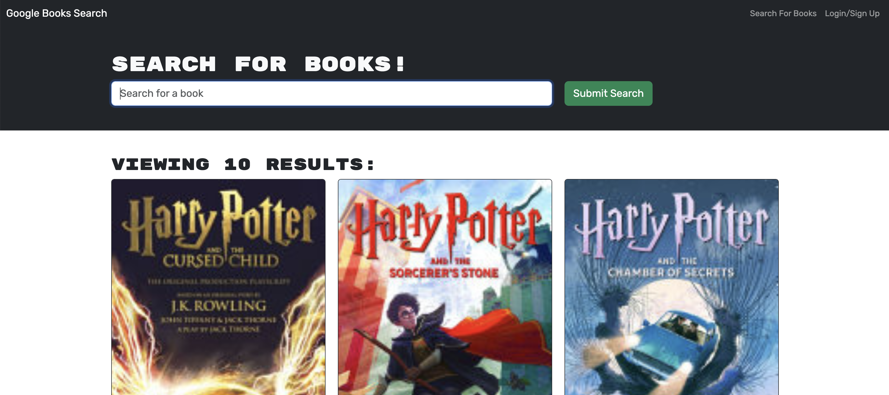

# Google Books API Search Engine

## A website that enables you to search books via the Google Books API and lets you save it to your account.

## Features

- The site was refactored to be a GraphQL API built with Apollo Server
- The site is set up with Apollo Server to use GraphQL queries and mutations to fetch and modify data, replacing the existing RESTful API.
- It gives you the option to create an account
- You can search for books using the Google Books API and save books you would like to read to your account.
- The save book option is only available to registered users
- Once you are done reading the book, you can delete the book from your account
- The code can be downloaded to you local machine. You need to install the packages using `npm install ` and then use `npm run develop` to start the site in your local host

## Installation Instructions

- Download the files from the repo
- Run `npm install` to install the necessary dependencies
- Run `npm run develop` and go to site on the local host

## Website Preview

## Working Example
[View the website here](https://gcsdesign-blog-43fec2242915.herokuapp.com/)

